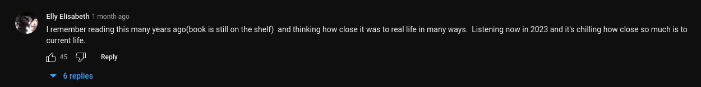
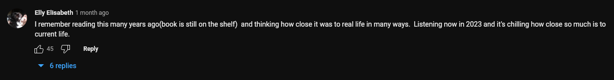
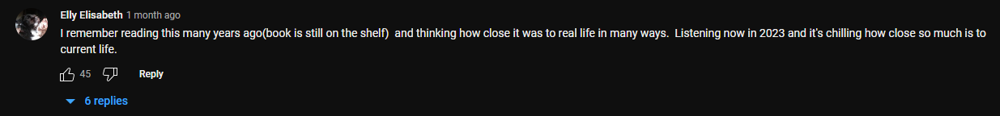
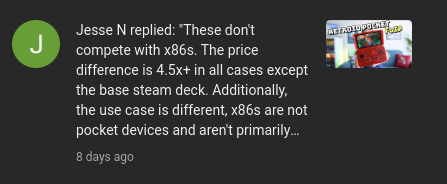
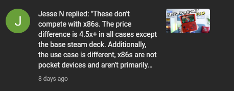
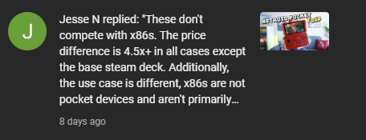

Here you can see the comparison between stock chrome with the patched one (see chromium.md)

Patch: [chromium.md](../chromium.md#better-text-rendering)

YouTube test: https://www.youtube.com/watch?v=iesAEtjA9wo
Twitter test: https://twitter.com/neilsonks/status/1657502130595328000

(click on them to see them properly)

| Linux (stock) | Linux (patched) | Windows |
|----------|:-------------:|------:|
|  |   |  |
|  |   |  |
|  |   |  |
|  |   |  |

